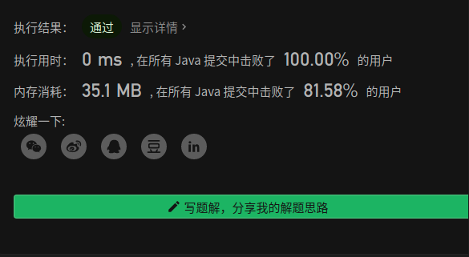
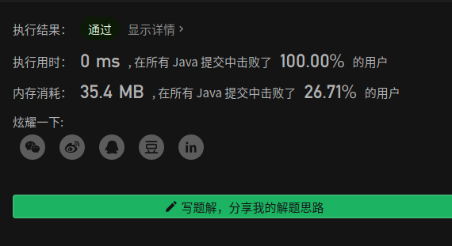

# 递归思想

## 1.概念	

递推法是一种重要的数学方法，在数学的各个领域中都有广泛的运用，也是计算机用于数值计算的一个重要算法。这种算法特点是：一个问题的求解需一系列的计算，在已知条件和所求问题之间总存在着某种相互联系的关系，在计算时，如果可以找到前后过程之间的数量关系（即递推式），那么，从问题出发逐步推到已知条件，此种方法叫逆推。无论顺推还是逆推，其关键是要找到递推式。这种处理问题的方法能使复杂运算化为若干步重复的简单运算，充分发挥出计算机擅长于重复处理的特点。递推算法的首要问题是得到相邻的数据项间的关系（即递推关系）。递推算法避开了求通项公式的麻烦，把一个复杂的问题的求解，分解成了连续的若干步简单运算。一般说来，可以将递推算法看成是一种特殊的迭代算法。

##  2.举例

```tex
一只青蛙一次可以跳上1级台阶，也可以跳上2级台阶。求该青蛙跳上一个 n 级的台阶总共有多少种跳法。
答案需要取模 1e9+7（1000000007），如计算初始结果为：1000000008，请返回 1。
示例 1：
    输入：n = 2
    输出：2
示例 2：
    输入：n = 7
    输出：21	
示例 3：
    输入：n = 0
    输出：1
来源：力扣（LeetCode）
链接：https://leetcode-cn.com/problems/qing-wa-tiao-tai-jie-wen-ti-lcof
著作权归领扣网络所有。商业转载请联系官方授权，非商业转载请注明出处。
```

```java
public int numWays(int n) {
       if (n ==0 || n == 1) {
            return 1;
        }
        int f0 = 1, f1 = 1;
        int i = 2;
        int fi = 0;
        while (i <= n) {
            fi = (f0 + f1)%1000000007;
            f0 = f1;
            f1 = fi;
            i++;
        }
        return fi;
    }
}
```


```tex
写一个函数，输入 n ，求斐波那契（Fibonacci）数列的第 n 项（即 F(N)）。斐波那契数列的定义如下：
F(0) = 0,   F(1) = 1
F(N) = F(N - 1) + F(N - 2), 其中 N > 1.
斐波那契数列由 0 和 1 开始，之后的斐波那契数就是由之前的两数相加而得出。
答案需要取模 1e9+7（1000000007），如计算初始结果为：1000000008，请返回 1。
来源：力扣（LeetCode）
链接：https://leetcode-cn.com/problems/fei-bo-na-qi-shu-lie-lcof
著作权归领扣网络所有。商业转载请联系官方授权，非商业转载请注明出处。
```

```java
public int fib(int n) {
        if (n <= 1) {
            return n;
        }
        int f0 = 0, f1 = 1, i = 2, fi = 0,mod=1000000007;
        while (i <= n) {
            fi = (f0 + f1)%mod;
            f0 = f1;
            f1 = fi;
            i++;
        }
        return fi;
    }
```



